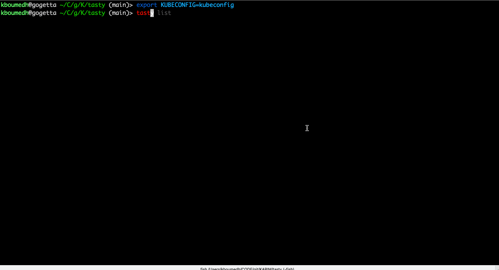

# Tasty repository

Tasty is a CLI to handle operators in a package manager fashion.

The tool provides the following primitives to interact with olm:

- list
- info
- install
- remove
- search

Additionally, it can be used as a go library

As an alternative, consider [kubectl-operator](https://github.com/operator-framework/kubectl-operator)

## Demo!



## Installing

```
curl -s -L https://github.com/karmab/tasty/releases/latest/download/tasty-linux-amd64 > /usr/bin/tasty
chmod u+x /usr/bin/tasty
```

### Some tasty install samples

- Install OLM operators changing the sourceNamespace value

```bash
tasty install assisted-service-operator hive-operator --sourcens olm
```

- Install OLM operators changing the CatalogSource and sourceNamespace value

```bash
tasty install assisted-service-operator hive-operator --source certified-operators --sourcens olm
```

- Print yaml of OLM operator without install

```bash
tasty install assisted-service-operator
```

## Requirements

Kubeconfig environment variable must be set

```
export KUBECONFIG=/path/to/kubeconfig
```

Alternatively, you can rely on your `~/.kube/config`

##  Running as kubelet and oc plugin

Run the following and you can then use `kubectl olm` or `oc olm`

```
tasty config --enable-as-plugin
```

## Using as a go library

Import tasty:

```
import "github.com/karmab/tasty/pkg/operator"
```

Then, create an operator using the constructor:

```
o := operator.NewOperator()
```

or with specific options:

```
o := operator.NewOperatorWithOptions(name, source, defaultChannel, description, csv, namespace, crd, configExecFile, configExecPath string)
```

The following methods are available to manage the operator:

```
o.SearchOperator()
o.GetList()
o.GetInfo()
o.SetConfiguration()
o.GetOperator()
o.InstallOperator()
```

## Installing operators from a pod

Check [job.yml.sample](job.yml.sample) as an example of a job that will install a given operator using a sa with cluster admin privileges

## Problems?

Open an issue!

Mc Fly!!!

karmab
